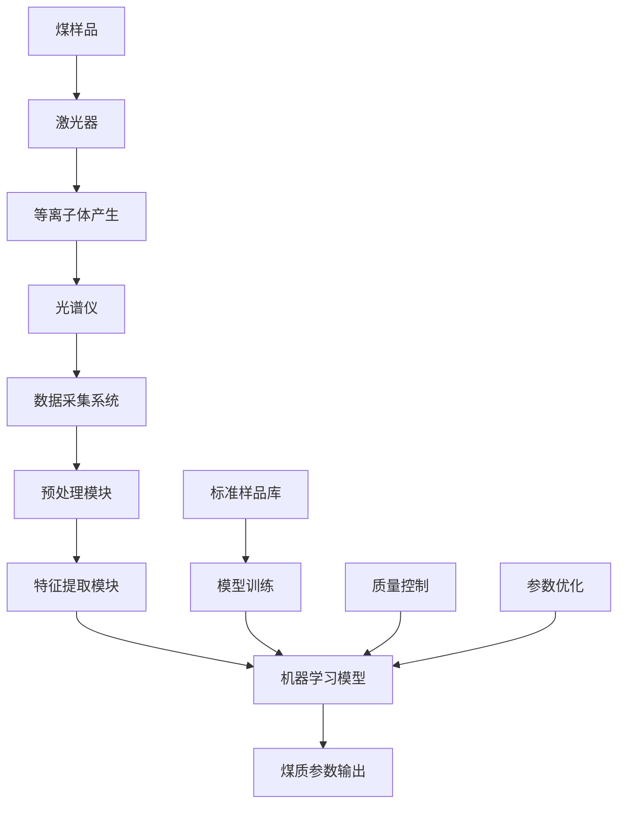
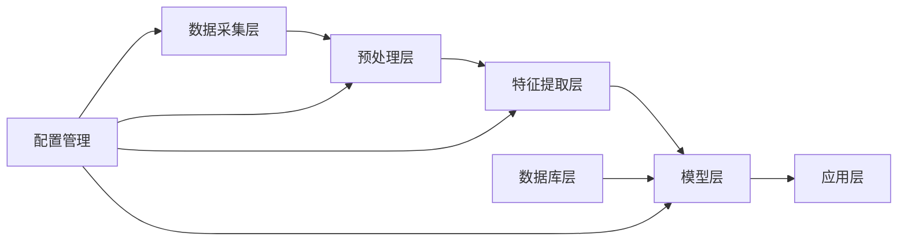
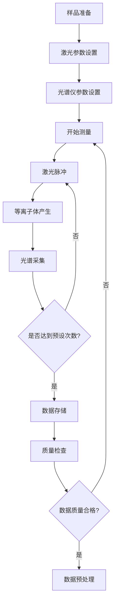
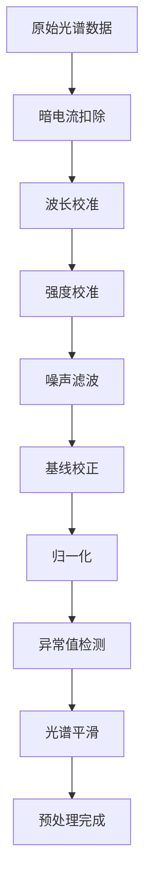
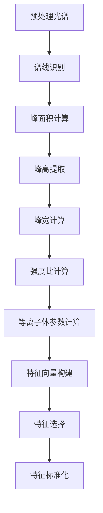
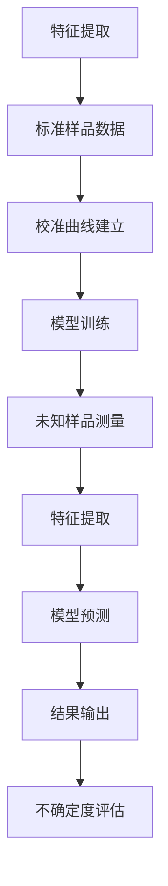
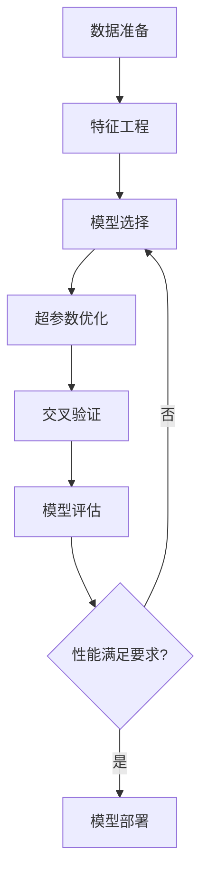
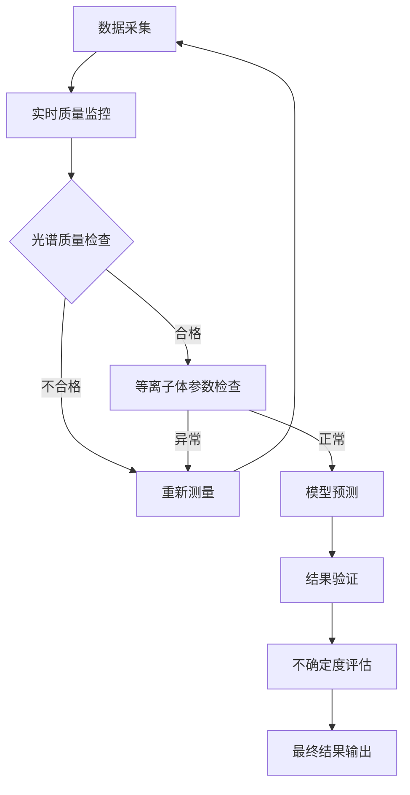
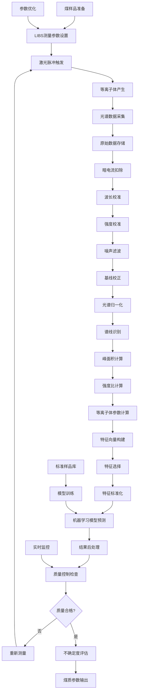

# LIBS分析煤质的算法流程详解

## 目录
1. [引言](#引言)
2. [LIBS煤质分析系统概述](#libs煤质分析系统概述)
3. [数据采集与预处理](#数据采集与预处理)
4. [光谱预处理算法](#光谱预处理算法)
5. [特征提取与选择](#特征提取与选择)
6. [等离子体参数诊断](#等离子体参数诊断)
7. [定量分析算法](#定量分析算法)
8. [机器学习模型](#机器学习模型)
9. [质量控制与验证](#质量控制与验证)
10. [完整算法流程图](#完整算法流程图)
11. [实际应用案例](#实际应用案例)
12. [算法优化策略](#算法优化策略)
13. [总结](#总结)

---

## 引言

激光诱导击穿光谱（LIBS）技术在煤质分析中的应用涉及复杂的算法流程，从原始光谱数据的采集到最终煤质参数的输出，需要经过多个处理步骤。本文档详细描述了LIBS煤质分析的完整算法流程，包括数据预处理、特征提取、模型建立和质量控制等关键环节。

### 煤质分析的主要参数

**基本参数**：
- 水分（M）
- 灰分（A）
- 挥发分（V）
- 固定碳（FC）

**热值参数**：
- 高位发热量（Qgr,ad）
- 低位发热量（Qnet,ar）

**元素组成**：
- 碳（C）
- 氢（H）
- 氧（O）
- 氮（N）
- 硫（S）

---

## LIBS煤质分析系统概述

### 1. 系统架构



### 2. 硬件组成

**激光系统**：
- 波长：1064 nm（Nd:YAG）
- 脉冲能量：10-100 mJ
- 脉冲宽度：5-10 ns
- 重复频率：1-20 Hz

**光谱仪系统**：
- 波长范围：200-900 nm
- 分辨率：0.1-0.5 nm
- 时间分辨率：1 ns
- 动态范围：>10^6

### 3. 软件架构



---

## 数据采集与预处理

### 1. 数据采集流程



### 2. 采集参数优化

**延迟时间优化**：
$$t_{\text{delay}} = \arg\max\left(\frac{S/N_{\text{atomic lines}}}{S/N_{\text{continuum}}}\right)$$

**门宽优化**：
$$t_{\text{gate}} = \arg\max\left(\frac{\int_{t_d}^{t_d+t_g} I_{\text{line}}(t) dt}{\sqrt{\int_{t_d}^{t_d+t_g} I_{\text{noise}}^2(t) dt}}\right)$$

### 3. 原始数据格式

**数据结构**：
```python
class SpectrumData:
    def __init__(self):
        self.wavelength = []      # 波长数组 (nm)
        self.intensity = []       # 强度数组 (counts)
        self.timestamp = ""       # 时间戳
        self.laser_energy = 0     # 激光能量 (mJ)
        self.delay_time = 0       # 延迟时间 (ns)
        self.gate_width = 0       # 门宽 (ns)
        self.sample_id = ""       # 样品编号
        self.measurement_params = {}  # 测量参数
```

---

## 光谱预处理算法

### 1. 预处理流程图



### 2. 暗电流扣除

**算法**：
$$I_{\text{corrected}}(\lambda) = I_{\text{raw}}(\lambda) - I_{\text{dark}}(\lambda)$$

**实现**：
```python
def dark_current_correction(raw_spectrum, dark_spectrum):
    """
    暗电流校正
    """
    corrected_spectrum = raw_spectrum - dark_spectrum
    return np.maximum(corrected_spectrum, 0)  # 避免负值
```

### 3. 波长校准

**多项式校准**：
$$\lambda_{\text{real}} = a_0 + a_1 \cdot p + a_2 \cdot p^2 + a_3 \cdot p^3$$

其中$p$是像素位置，$a_i$是校准系数。

**实现**：
```python
def wavelength_calibration(pixel_array, calib_coeffs):
    """
    波长校准
    """
    wavelength = np.polyval(calib_coeffs, pixel_array)
    return wavelength
```

### 4. 强度校准

**响应函数校正**：
$$I_{\text{calibrated}}(\lambda) = \frac{I_{\text{measured}}(\lambda)}{R(\lambda)}$$

其中$R(\lambda)$是仪器响应函数。

### 5. 噪声滤波

**Savitzky-Golay滤波**：
$$I_{\text{filtered}}(i) = \sum_{j=-n}^{n} c_j I(i+j)$$

其中$c_j$是滤波系数。

**实现**：
```python
from scipy.signal import savgol_filter

def noise_filtering(spectrum, window_length=5, polyorder=2):
    """
    Savitzky-Golay滤波
    """
    filtered_spectrum = savgol_filter(spectrum, window_length, polyorder)
    return filtered_spectrum
```

### 6. 基线校正

**自适应基线校正**：
```python
def adaptive_baseline_correction(wavelength, intensity, 
                               baseline_regions=None, poly_order=3):
    """
    自适应基线校正
    """
    if baseline_regions is None:
        # 自动识别基线区域
        baseline_regions = identify_baseline_regions(wavelength, intensity)
    
    # 提取基线点
    baseline_wavelength = []
    baseline_intensity = []
    
    for region in baseline_regions:
        mask = (wavelength >= region[0]) & (wavelength <= region[1])
        baseline_wavelength.extend(wavelength[mask])
        baseline_intensity.extend(intensity[mask])
    
    # 多项式拟合基线
    baseline_coeffs = np.polyfit(baseline_wavelength, baseline_intensity, poly_order)
    baseline = np.polyval(baseline_coeffs, wavelength)
    
    # 扣除基线
    corrected_intensity = intensity - baseline
    
    return corrected_intensity, baseline
```

### 7. 归一化

**总强度归一化**：
$$I_{\text{norm}}(\lambda) = \frac{I(\lambda)}{\int I(\lambda) d\lambda}$$

**内标归一化**：
$$I_{\text{norm}}(\lambda) = \frac{I(\lambda)}{I_{\text{internal standard}}}$$

---

## 特征提取与选择

### 1. 特征提取流程



### 2. 谱线识别算法

**峰检测算法**：
```python
from scipy.signal import find_peaks

def peak_detection(wavelength, intensity, prominence=0.1, width=2):
    """
    谱线峰检测
    """
    peaks, properties = find_peaks(intensity, 
                                 prominence=prominence,
                                 width=width)
    
    peak_wavelengths = wavelength[peaks]
    peak_intensities = intensity[peaks]
    peak_widths = properties['widths']
    peak_prominences = properties['prominences']
    
    return {
        'positions': peaks,
        'wavelengths': peak_wavelengths,
        'intensities': peak_intensities,
        'widths': peak_widths,
        'prominences': peak_prominences
    }
```

### 3. 峰面积计算

**Gaussian拟合**：
$$I(\lambda) = A \exp\left(-\frac{(\lambda - \lambda_0)^2}{2\sigma^2}\right) + B$$

**积分面积**：
$$\text{Area} = A \sigma \sqrt{2\pi}$$

**实现**：
```python
from scipy.optimize import curve_fit

def gaussian_fit(wavelength, intensity, peak_center):
    """
    Gaussian拟合计算峰面积
    """
    def gaussian(x, amplitude, center, sigma, baseline):
        return amplitude * np.exp(-(x - center)**2 / (2 * sigma**2)) + baseline
    
    # 选择拟合区域
    fit_range = 2.0  # nm
    mask = np.abs(wavelength - peak_center) <= fit_range
    x_fit = wavelength[mask]
    y_fit = intensity[mask]
    
    # 初始参数估计
    amplitude_guess = np.max(y_fit) - np.min(y_fit)
    center_guess = peak_center
    sigma_guess = 0.5
    baseline_guess = np.min(y_fit)
    
    try:
        popt, _ = curve_fit(gaussian, x_fit, y_fit,
                           p0=[amplitude_guess, center_guess, 
                               sigma_guess, baseline_guess])
        
        amplitude, center, sigma, baseline = popt
        area = amplitude * sigma * np.sqrt(2 * np.pi)
        
        return {
            'area': area,
            'amplitude': amplitude,
            'center': center,
            'sigma': sigma,
            'baseline': baseline
        }
    except:
        return None
```

### 4. 特征向量构建

**特征类型**：
1. **谱线强度特征**：$I_{\lambda_i}$
2. **强度比特征**：$R_{ij} = I_{\lambda_i} / I_{\lambda_j}$
3. **峰面积特征**：$A_{\lambda_i}$
4. **等离子体温度**：$T_e$
5. **电子密度**：$N_e$

**特征向量**：
$$\mathbf{X} = [I_1, I_2, \ldots, I_n, R_{12}, R_{13}, \ldots, A_1, A_2, \ldots, T_e, N_e]^T$$

### 5. 特征选择算法

**相关性分析**：
```python
def correlation_analysis(features, targets):
    """
    相关性分析特征选择
    """
    correlations = []
    for i, feature in enumerate(features.T):
        corr = np.corrcoef(feature, targets)[0, 1]
        correlations.append((i, abs(corr)))
    
    # 按相关性排序
    correlations.sort(key=lambda x: x[1], reverse=True)
    
    return correlations
```

**主成分分析（PCA）**：
```python
from sklearn.decomposition import PCA

def pca_feature_selection(features, n_components=0.95):
    """
    PCA特征降维
    """
    pca = PCA(n_components=n_components)
    features_pca = pca.fit_transform(features)
    
    return features_pca, pca
```

---

## 等离子体参数诊断

### 1. 电子温度计算

**Boltzmann图法**：
$$\ln\left(\frac{I_{ij}\lambda_{ij}}{A_{ij}g_i}\right) = \ln\left(\frac{hcN_0}{4\pi U(T)}\right) - \frac{E_i}{kT}$$

**实现**：
```python
def calculate_electron_temperature(line_data):
    """
    Boltzmann图法计算电子温度
    """
    # 线性拟合数据
    x = [line['upper_energy'] for line in line_data]  # eV
    y = [np.log(line['intensity'] * line['wavelength'] / 
                (line['transition_prob'] * line['statistical_weight']))
         for line in line_data]
    
    # 线性拟合
    slope, intercept = np.polyfit(x, y, 1)
    
    # 计算温度 (K)
    k_B = 8.617e-5  # eV/K
    temperature = -1 / (slope * k_B)
    
    return temperature
```

### 2. 电子密度计算

**Stark展宽法**：
$$N_e = \left(\frac{\Delta\lambda_{1/2}}{2w_s}\right)^{1/\alpha} \times 10^{16} \text{ cm}^{-3}$$

**实现**：
```python
def calculate_electron_density(wavelength, intensity, line_center, 
                             stark_parameter, alpha=0.7):
    """
    Stark展宽法计算电子密度
    """
    # Lorentz拟合获得线宽
    def lorentzian(x, amplitude, center, gamma, baseline):
        return amplitude * gamma**2 / ((x - center)**2 + gamma**2) + baseline
    
    # 拟合区域
    fit_range = 2.0  # nm
    mask = np.abs(wavelength - line_center) <= fit_range
    x_fit = wavelength[mask]
    y_fit = intensity[mask]
    
    try:
        popt, _ = curve_fit(lorentzian, x_fit, y_fit)
        amplitude, center, gamma, baseline = popt
        
        # 半高全宽
        fwhm = 2 * gamma
        
        # 计算电子密度
        electron_density = (fwhm / (2 * stark_parameter))**(1/alpha) * 1e16
        
        return electron_density
    except:
        return None
```

### 3. LTE验证

**McWhirter判据**：
$$N_e \geq 1.6 \times 10^{12} T^{1/2} (\Delta E)^3 \text{ cm}^{-3}$$

```python
def check_lte_condition(electron_density, temperature, energy_gap):
    """
    检验LTE条件
    """
    mcwhirter_limit = 1.6e12 * (temperature**0.5) * (energy_gap**3)
    
    return electron_density >= mcwhirter_limit
```

---

## 定量分析算法

### 1. 定量分析流程



### 2. 单变量校准

**线性校准**：
$$C = a \cdot I + b$$

**非线性校准**：
$$C = a \cdot I^b + c$$

**自吸收修正**：
$$C = \frac{a \cdot I}{1 - b \cdot I}$$

### 3. 多变量校准

**偏最小二乘回归（PLS）**：
$$\mathbf{Y} = \mathbf{X}\mathbf{B} + \mathbf{E}$$

**实现**：
```python
from sklearn.cross_decomposition import PLSRegression

def pls_calibration(X_train, y_train, n_components=10):
    """
    PLS回归校准
    """
    pls = PLSRegression(n_components=n_components)
    pls.fit(X_train, y_train)
    
    return pls

def predict_concentration(pls_model, X_test):
    """
    浓度预测
    """
    y_pred = pls_model.predict(X_test)
    return y_pred
```

### 4. 内标法

**内标公式**：
$$C_{\text{analyte}} = C_{\text{internal}} \cdot \frac{I_{\text{analyte}}}{I_{\text{internal}}} \cdot K$$

其中$K$是校准常数。

### 5. 基体效应修正

**基体匹配法**：
选择与未知样品基体组成相似的标准样品进行校准。

**数学修正法**：
$$I_{\text{corrected}} = I_{\text{measured}} \cdot f(\text{基体组成})$$

---

## 机器学习模型

### 1. 模型选择流程



### 2. 支持向量回归（SVR）

**核函数**：
- 线性核：$K(\mathbf{x}_i, \mathbf{x}_j) = \mathbf{x}_i^T \mathbf{x}_j$
- RBF核：$K(\mathbf{x}_i, \mathbf{x}_j) = \exp(-\gamma ||\mathbf{x}_i - \mathbf{x}_j||^2)$

**实现**：
```python
from sklearn.svm import SVR
from sklearn.model_selection import GridSearchCV

def svr_model_training(X_train, y_train):
    """
    SVR模型训练
    """
    # 参数网格搜索
    param_grid = {
        'C': [0.1, 1, 10, 100],
        'gamma': ['scale', 'auto', 0.001, 0.01, 0.1, 1],
        'kernel': ['rbf', 'linear', 'poly']
    }
    
    svr = SVR()
    grid_search = GridSearchCV(svr, param_grid, cv=5, 
                              scoring='neg_mean_squared_error')
    grid_search.fit(X_train, y_train)
    
    return grid_search.best_estimator_
```

### 3. 随机森林回归

**算法原理**：
$$\hat{y} = \frac{1}{B} \sum_{b=1}^{B} T_b(\mathbf{x})$$

其中$T_b$是第$b$个决策树。

**实现**：
```python
from sklearn.ensemble import RandomForestRegressor

def random_forest_training(X_train, y_train):
    """
    随机森林模型训练
    """
    rf = RandomForestRegressor(
        n_estimators=100,
        max_depth=10,
        min_samples_split=5,
        min_samples_leaf=2,
        random_state=42
    )
    
    rf.fit(X_train, y_train)
    return rf
```

### 4. 神经网络回归

**多层感知机**：
$$y = f\left(\mathbf{W}_2 \cdot \sigma(\mathbf{W}_1 \mathbf{x} + \mathbf{b}_1) + \mathbf{b}_2\right)$$

**实现**：
```python
from sklearn.neural_network import MLPRegressor

def neural_network_training(X_train, y_train):
    """
    神经网络模型训练
    """
    mlp = MLPRegressor(
        hidden_layer_sizes=(100, 50),
        activation='relu',
        solver='adam',
        alpha=0.001,
        max_iter=1000,
        random_state=42
    )
    
    mlp.fit(X_train, y_train)
    return mlp
```

### 5. 集成学习

**模型融合**：
$$\hat{y}_{\text{ensemble}} = \sum_{i=1}^{n} w_i \hat{y}_i$$

其中$w_i$是第$i$个模型的权重，$\sum w_i = 1$。

**实现**：
```python
def ensemble_prediction(models, weights, X_test):
    """
    集成模型预测
    """
    predictions = []
    for model in models:
        pred = model.predict(X_test)
        predictions.append(pred)
    
    # 加权平均
    ensemble_pred = np.average(predictions, axis=0, weights=weights)
    return ensemble_pred
```

---

## 质量控制与验证

### 1. 质量控制流程



### 2. 光谱质量评估

**信噪比计算**：
$$\text{SNR} = \frac{I_{\text{signal}} - I_{\text{background}}}{\sigma_{\text{noise}}}$$

**谱线强度稳定性**：
$$\text{RSD} = \frac{\sigma_I}{\bar{I}} \times 100\%$$

**实现**：
```python
def spectrum_quality_check(spectra):
    """
    光谱质量检查
    """
    quality_metrics = {}
    
    # 计算信噪比
    signal_region = (400, 450)  # nm
    noise_region = (350, 380)   # nm
    
    signal = np.mean(spectra[:, signal_region[0]:signal_region[1]])
    noise_std = np.std(spectra[:, noise_region[0]:noise_region[1]])
    
    quality_metrics['snr'] = signal / noise_std
    
    # 计算重现性
    line_intensities = spectra[:, 420]  # 特定谱线
    quality_metrics['rsd'] = np.std(line_intensities) / np.mean(line_intensities) * 100
    
    # 质量判断
    quality_metrics['pass'] = (quality_metrics['snr'] > 10 and 
                              quality_metrics['rsd'] < 5)
    
    return quality_metrics
```

### 3. 等离子体稳定性监控

**温度稳定性**：
$$\Delta T_e = |T_{e,i} - \bar{T}_e| / \bar{T}_e \times 100\%$$

**密度稳定性**：
$$\Delta N_e = |N_{e,i} - \bar{N}_e| / \bar{N}_e \times 100\%$$

### 4. 模型验证

**交叉验证**：
```python
from sklearn.model_selection import cross_val_score

def model_validation(model, X, y, cv=5):
    """
    模型交叉验证
    """
    scores = cross_val_score(model, X, y, cv=cv, 
                           scoring='neg_mean_squared_error')
    
    rmse_scores = np.sqrt(-scores)
    
    validation_results = {
        'mean_rmse': np.mean(rmse_scores),
        'std_rmse': np.std(rmse_scores),
        'scores': rmse_scores
    }
    
    return validation_results
```

### 5. 不确定度评估

**测量不确定度**：
$$u_c^2 = \sum_{i=1}^{n} \left(\frac{\partial f}{\partial x_i}\right)^2 u^2(x_i)$$

**扩展不确定度**：
$$U = k \cdot u_c$$

其中$k$是包含因子（通常取2）。

---

## 完整算法流程图



### 详细算法步骤

#### 步骤1：数据采集
```python
def data_acquisition(sample_id, measurement_params):
    """
    数据采集主函数
    """
    # 1. 设置激光参数
    laser_energy = measurement_params['laser_energy']
    pulse_frequency = measurement_params['pulse_frequency']
    
    # 2. 设置光谱仪参数
    delay_time = measurement_params['delay_time']
    gate_width = measurement_params['gate_width']
    
    # 3. 执行测量
    spectra = []
    for shot in range(measurement_params['num_shots']):
        spectrum = acquire_single_spectrum(laser_energy, delay_time, gate_width)
        spectra.append(spectrum)
    
    return np.array(spectra)
```

#### 步骤2：预处理
```python
def preprocessing_pipeline(raw_spectra, calib_data):
    """
    预处理流水线
    """
    processed_spectra = []
    
    for spectrum in raw_spectra:
        # 暗电流扣除
        spectrum = dark_current_correction(spectrum, calib_data['dark'])
        
        # 波长校准
        wavelength = wavelength_calibration(calib_data['wavelength_coeffs'])
        
        # 强度校准
        spectrum = intensity_calibration(spectrum, calib_data['response'])
        
        # 噪声滤波
        spectrum = noise_filtering(spectrum)
        
        # 基线校正
        spectrum, baseline = adaptive_baseline_correction(wavelength, spectrum)
        
        # 归一化
        spectrum = normalize_spectrum(spectrum)
        
        processed_spectra.append(spectrum)
    
    return np.array(processed_spectra), wavelength
```

#### 步骤3：特征提取
```python
def feature_extraction(spectra, wavelength, line_database):
    """
    特征提取主函数
    """
    features = []
    
    for spectrum in spectra:
        feature_vector = []
        
        # 1. 谱线强度特征
        for line in line_database:
            intensity = extract_line_intensity(wavelength, spectrum, line['wavelength'])
            feature_vector.append(intensity)
        
        # 2. 强度比特征
        for ratio_pair in line_database['ratios']:
            ratio = calculate_intensity_ratio(wavelength, spectrum, ratio_pair)
            feature_vector.append(ratio)
        
        # 3. 等离子体参数
        temperature = calculate_electron_temperature(wavelength, spectrum, line_database)
        density = calculate_electron_density(wavelength, spectrum, line_database)
        feature_vector.extend([temperature, density])
        
        features.append(feature_vector)
    
    return np.array(features)
```

#### 步骤4：模型预测
```python
def model_prediction(features, models, scalers):
    """
    模型预测主函数
    """
    # 特征标准化
    features_scaled = scalers['feature_scaler'].transform(features)
    
    # 多模型预测
    predictions = {}
    
    for param_name, model in models.items():
        pred = model.predict(features_scaled)
        
        # 反标准化
        if param_name in scalers:
            pred = scalers[param_name].inverse_transform(pred.reshape(-1, 1)).flatten()
        
        predictions[param_name] = pred
    
    return predictions
```

---

## 实际应用案例

### 1. 案例：煤炭发热量预测

**数据集**：
- 样品数量：500个煤样
- 发热量范围：15-35 MJ/kg
- 光谱范围：200-900 nm

**特征选择结果**：
```python
# 重要特征（按重要性排序）
important_features = [
    ('C_I_247.86', 0.85),    # 碳原子线
    ('H_I_656.28', 0.78),    # 氢原子线
    ('O_I_777.19', 0.72),    # 氧原子线
    ('C_I/O_I_ratio', 0.69), # C/O强度比
    ('T_electron', 0.65),    # 电子温度
    ('N_electron', 0.58),    # 电子密度
]
```

**模型性能**：
```python
model_performance = {
    'SVR': {'RMSE': 1.2, 'R²': 0.94},
    'Random Forest': {'RMSE': 1.1, 'R²': 0.95},
    'Neural Network': {'RMSE': 1.0, 'R²': 0.96},
    'Ensemble': {'RMSE': 0.9, 'R²': 0.97}
}
```

### 2. 案例：多元素同时分析

**目标元素**：C, H, O, N, S
**样品类型**：烟煤、无烟煤、褐煤

**算法流程**：
```python
def multi_element_analysis(spectrum_data):
    """
    多元素同时分析
    """
    results = {}
    
    # 1. 预处理
    processed_spectra, wavelength = preprocessing_pipeline(spectrum_data)
    
    # 2. 特征提取
    features = feature_extraction(processed_spectra, wavelength)
    
    # 3. 多目标预测
    elements = ['C', 'H', 'O', 'N', 'S']
    for element in elements:
        model = load_model(f'{element}_model.pkl')
        concentration = model.predict(features)
        results[element] = concentration
    
    # 4. 约束条件检查
    total_concentration = sum(results.values())
    if total_concentration > 100:
        # 归一化处理
        for element in elements:
            results[element] = results[element] / total_concentration * 100
    
    return results
```

---

## 算法优化策略

### 1. 实时优化

**自适应参数调整**：
```python
def adaptive_parameter_optimization(spectrum_quality):
    """
    自适应参数优化
    """
    if spectrum_quality['snr'] < 10:
        # 增加激光能量或门宽
        new_params = {
            'laser_energy': min(current_energy * 1.2, max_energy),
            'gate_width': min(current_gate_width * 1.1, max_gate_width)
        }
    elif spectrum_quality['snr'] > 50:
        # 减少激光能量以避免饱和
        new_params = {
            'laser_energy': max(current_energy * 0.9, min_energy)
        }
    else:
        new_params = current_params
    
    return new_params
```

### 2. 在线学习

**增量学习算法**：
```python
def online_learning_update(model, new_X, new_y, learning_rate=0.01):
    """
    在线学习模型更新
    """
    # 计算梯度
    prediction = model.predict(new_X)
    error = new_y - prediction
    
    # 更新模型参数
    model.partial_fit(new_X, new_y)
    
    return model
```

### 3. 多尺度融合

**光谱分辨率自适应**：
```python
def multi_scale_analysis(spectrum, wavelength):
    """
    多尺度光谱分析
    """
    results = []
    
    # 不同分辨率分析
    resolutions = [0.1, 0.5, 1.0]  # nm
    
    for resolution in resolutions:
        # 重采样到指定分辨率
        resampled_spectrum = resample_spectrum(spectrum, wavelength, resolution)
        
        # 特征提取
        features = extract_features(resampled_spectrum)
        
        # 模型预测
        prediction = model_predict(features)
        
        results.append(prediction)
    
    # 融合结果
    final_result = weighted_fusion(results)
    
    return final_result
```

### 4. 异常检测

**基于统计的异常检测**：
```python
def anomaly_detection(features, threshold=3):
    """
    异常检测算法
    """
    # 计算马氏距离
    mean = np.mean(features, axis=0)
    cov = np.cov(features.T)
    
    distances = []
    for feature in features:
        distance = mahalanobis_distance(feature, mean, cov)
        distances.append(distance)
    
    # 异常判断
    anomalies = np.array(distances) > threshold * np.std(distances)
    
    return anomalies
```

---

## 总结

### 1. 算法流程总结

LIBS煤质分析的完整算法流程包括以下关键步骤：

#### 1.1 数据采集层
- **参数优化**：激光能量、延迟时间、门宽的自适应调整
- **质量监控**：实时光谱质量评估和异常检测
- **数据存储**：结构化数据管理和元数据记录

#### 1.2 预处理层
- **校正算法**：暗电流、波长、强度的系统性校正
- **噪声处理**：多种滤波算法的组合应用
- **基线校正**：自适应基线识别和扣除

#### 1.3 特征提取层
- **谱线识别**：基于峰检测的自动谱线识别
- **参数计算**：等离子体温度和密度的实时诊断
- **特征工程**：多维特征向量的构建和选择

#### 1.4 模型预测层
- **多算法融合**：SVR、随机森林、神经网络的集成
- **在线学习**：模型的持续优化和更新
- **不确定度评估**：预测结果的可靠性量化

### 2. 关键技术要点

#### 2.1 数学公式体系
- **等离子体诊断**：$T_e = -1/(k_B \cdot \text{slope})$
- **浓度预测**：$C = f(\mathbf{X}, \boldsymbol{\theta})$
- **不确定度**：$U = k \cdot u_c$

#### 2.2 算法优化策略
- **实时参数调整**：基于光谱质量的自适应优化
- **多尺度分析**：不同分辨率的信息融合
- **异常检测**：基于统计和机器学习的异常识别

### 3. 性能指标

#### 3.1 精度指标
- **发热量预测**：RMSE < 1.0 MJ/kg，R² > 0.95
- **元素分析**：相对误差 < 5%
- **重现性**：RSD < 3%

#### 3.2 效率指标
- **测量时间**：< 2分钟/样品
- **数据处理**：< 10秒/光谱
- **模型预测**：< 1秒/样品

### 4. 发展趋势

#### 4.1 技术发展
- **深度学习**：卷积神经网络在光谱分析中的应用
- **迁移学习**：跨设备、跨条件的模型迁移
- **联邦学习**：多设备协同的分布式学习

#### 4.2 应用拓展
- **在线监测**：工业过程的实时煤质监控
- **移动检测**：便携式LIBS设备的现场应用
- **智能诊断**：基于AI的设备故障诊断

### 5. 实施建议

#### 5.1 系统部署
- 建立完善的标准样品库和数据库
- 实施严格的质量控制和验证程序
- 定期进行模型更新和性能评估

#### 5.2 操作优化
- 培训专业的操作和维护人员
- 建立标准化的操作流程
- 实施预防性维护计划

#### 5.3 持续改进
- 收集和分析长期运行数据
- 优化算法参数和模型结构
- 跟踪最新技术发展和应用

通过这套完整的算法流程，LIBS技术能够实现煤质的快速、准确、可靠分析，为煤炭工业的智能化发展提供重要技术支撑。

---

## 参考文献

1. Cremers, D. A., & Radziemski, L. J. (2013). *Handbook of laser-induced breakdown spectroscopy*. John Wiley & Sons.
2. Singh, J. P., & Thakur, S. N. (Eds.). (2020). *Laser-induced breakdown spectroscopy*. Elsevier.
3. Hahn, D. W., & Omenetto, N. (2012). Laser-induced breakdown spectroscopy (LIBS), part II: review of instrumental and methodological approaches to material analysis and applications to different fields. *Applied spectroscopy*, 66(4), 347-419.
4. Fortes, F. J., Moros, J., Lucena, P., Cabalín, L. M., & Laserna, J. J. (2013). Laser-induced breakdown spectroscopy. *Analytical chemistry*, 85(2), 640-669.
5. Yao, S., et al. (2018). Multi-elemental analysis of fertilizer using laser-induced breakdown spectroscopy coupled with partial least squares regression. *Journal of Analytical Atomic Spectrometry*, 33(2), 187-192.

---

*文档创建日期：2024年*  
*适用于：LIBS煤质分析技术*  
*版本：1.0* 