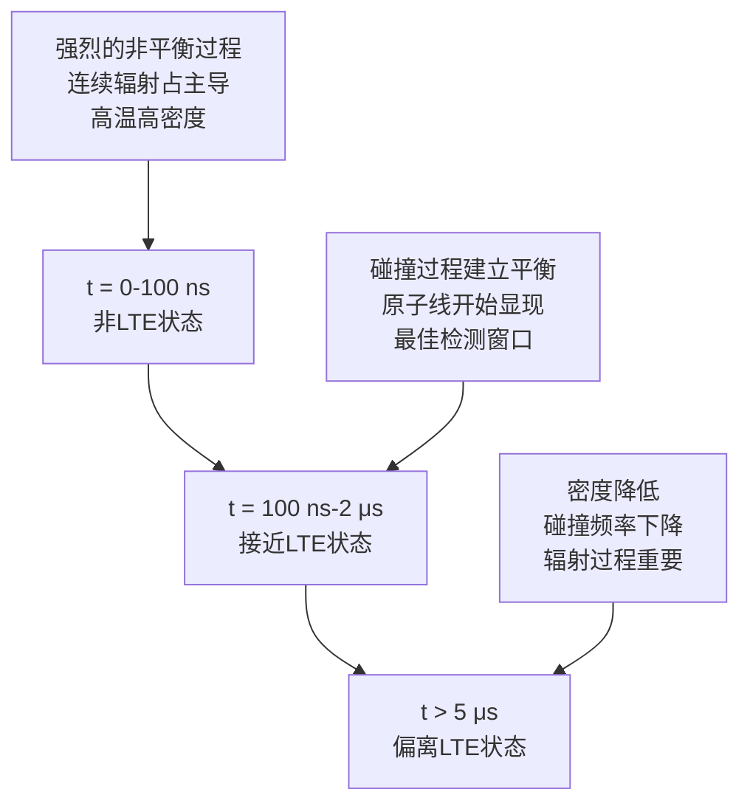

# LIBS中的LTE（局部热力学平衡）详解

## 目录
1. [LTE的基本概念](#lte的基本概念)
2. [LTE的数学表述](#lte的数学表述)
3. [LTE成立的条件](#lte成立的条件)
4. [LIBS中LTE的时空演化](#libs中lte的时空演化)
5. [LTE假设的验证方法](#lte假设的验证方法)
6. [LTE偏离的影响](#lte偏离的影响)
7. [实际LIBS实验中的LTE考虑](#实际libs实验中的lte考虑)
8. [LTE在不同LIBS应用中的考虑](#lte在不同libs应用中的考虑)
9. [总结](#总结)

---

## LTE的基本概念

### 定义

**局部热力学平衡（Local Thermodynamic Equilibrium, LTE）**是指在等离子体的局部区域内，虽然整个系统可能不处于完全的热力学平衡状态，但在足够小的空间尺度和时间尺度内，粒子的分布可以用热力学平衡的统计规律来描述。

### 物理意义

在LTE条件下，等离子体中的：
- **能级布居**遵循Boltzmann分布
- **电离度**遵循Saha方程
- **辐射场**接近黑体辐射（在光学厚度足够的情况下）

### 关键特征

| 特征 | LTE状态 | 非LTE状态 |
|------|---------|-----------|
| 能级布居 | Boltzmann分布 | 偏离Boltzmann分布 |
| 电离平衡 | Saha方程 | 偏离Saha方程 |
| 温度定义 | 单一温度 | 多个温度 |
| 碰撞过程 | 占主导 | 辐射过程重要 |

---

## LTE的数学表述

### 1. Boltzmann分布

在LTE条件下，原子在不同激发态的布居满足：

$$\frac{N_i}{N_j} = \frac{g_i}{g_j} \exp\left(-\frac{E_i - E_j}{kT}\right)$$

其中：
- $N_i, N_j$：能级$i$和$j$的粒子数密度
- $g_i, g_j$：统计权重
- $E_i, E_j$：能级能量
- $T$：电子温度

**实用形式**：
$$\frac{N_i}{N_0} = \frac{g_i}{g_0} \exp\left(-\frac{E_i}{kT}\right)$$

### 2. Saha方程

电离平衡遵循：

$$\frac{N_{\text{ion}} \cdot N_e}{N_{\text{atom}}} = \frac{2U_{\text{ion}}}{U_{\text{atom}}} \left(\frac{2\pi m_e kT}{h^2}\right)^{3/2} \exp\left(-\frac{E_{\text{ionization}}}{kT}\right)$$

**对数形式**：
$$\log\left(\frac{N_{\text{ion}} \cdot N_e}{N_{\text{atom}}}\right) = \log\left(\frac{2U_{\text{ion}}}{U_{\text{atom}}}\right) + 15.68 - \frac{5040 \times E_{\text{ionization}}}{T}$$

### 3. Maxwell分布

粒子速度分布遵循Maxwell分布：

$$f(v) = 4\pi n \left(\frac{m}{2\pi kT}\right)^{3/2} v^2 \exp\left(-\frac{mv^2}{2kT}\right)$$

### 4. 配分函数

原子和离子的配分函数：

$$U = \sum_i g_i \exp\left(-\frac{E_i}{kT}\right)$$

---

## LTE成立的条件

### 1. 碰撞频率条件

**关键要求**：碰撞过程必须比辐射过程快得多

$$\nu_{\text{collision}} \gg \nu_{\text{radiation}}$$

**具体表现**：
- 电子-原子碰撞激发/去激发
- 电子-离子碰撞电离/复合
- 粒子间的弹性碰撞

### 2. McWhirter判据

对于氢原子，LTE成立的最低电子密度要求：

$$\boxed{N_e \geq 1.6 \times 10^{12} T^{1/2} (\Delta E)^3 \text{ cm}^{-3}}$$

其中：
- $T$：电子温度（K）
- $\Delta E$：能级间隔（eV）

**实际应用示例**：
- 对于典型的LIBS条件（$T \sim 10000$ K，$\Delta E \sim 2$ eV）
- 要求 $N_e \geq 1.6 \times 10^{12} \times (10000)^{0.5} \times 2^3 = 1.3 \times 10^{15}$ cm⁻³

### 3. 时间尺度条件

**弛豫时间**必须远小于**等离子体演化时间**：

$$\tau_{\text{relaxation}} \ll \tau_{\text{plasma}}$$

**典型时间尺度**：
- 弛豫时间：1-10 ns
- 等离子体寿命：1-10 μs
- 比值：$\tau_{\text{relaxation}}/\tau_{\text{plasma}} < 0.01$

### 4. 空间尺度条件

**平均自由程**必须远小于**等离子体特征尺寸**：

$$\lambda_{\text{mfp}} \ll L_{\text{plasma}}$$

---

## LIBS中LTE的时空演化

### 时间演化



### 时间演化详细描述

| 时间阶段 | 等离子体状态 | LTE程度 | 主要特征 |
|----------|--------------|---------|----------|
| 0-100 ns | 形成期 | 非LTE | 连续辐射强，谱线弱 |
| 100 ns-2 μs | 稳定期 | 接近LTE | 原子线清晰，最佳检测 |
| 2-5 μs | 衰减期 | 部分LTE | 信号减弱，仍可检测 |
| >5 μs | 消散期 | 非LTE | 信号微弱，背景增加 |

### 空间分布

```
等离子体中心:    高密度 (Ne > 10^16 cm^-3)，接近LTE
等离子体中间:    中等密度 (Ne ~ 10^15 cm^-3)，部分LTE  
等离子体边缘:    低密度 (Ne < 10^14 cm^-3)，偏离LTE
等离子体羽流:    极低密度，非LTE状态
```

---

## LTE假设的验证方法

### 1. 温度一致性检验

使用不同方法测得的温度应该一致：

$$T_{\text{excitation}} \approx T_{\text{ionization}} \approx T_{\text{electron}}$$

**具体方法**：
- **激发温度**：Boltzmann图法
- **电离温度**：Saha方程法  
- **电子温度**：连续辐射法

**判断标准**：
$$\frac{|T_1 - T_2|}{(T_1 + T_2)/2} < 10\%$$

### 2. 线强度比检验

理论计算的线强度比应与实验值一致：

$$\frac{I_{\text{theoretical}}}{I_{\text{experimental}}} \approx 1 \pm 0.2$$

**计算公式**：
$$\frac{I_1}{I_2} = \frac{\lambda_2 g_1 A_1}{\lambda_1 g_2 A_2} \exp\left(-\frac{E_1 - E_2}{kT}\right)$$

### 3. 电子密度检验

不同方法测得的电子密度应该一致：
- **Stark展宽法**
- **Saha方程法**
- **连续辐射法**

### 4. McWhirter判据验证

验证实际电子密度是否满足：
$$N_e \geq N_{e,\text{min}} = 1.6 \times 10^{12} T^{1/2} (\Delta E)^3$$

---

## LTE偏离的影响

### 1. 对温度测量的影响

**非LTE效应**：
- 激发温度 ≠ 电离温度
- Boltzmann图出现非线性
- 温度测量不准确

**表现形式**：
```
LTE条件:     ln(Iλ/gA) vs E_i 呈完美直线
非LTE条件:   ln(Iλ/gA) vs E_i 出现弯曲或分段
```

**修正方法**：
- 使用非LTE模型
- 选择合适的检测时间窗口
- 考虑辐射传输效应

### 2. 对定量分析的影响

**浓度计算偏差**：
- 谱线强度与浓度的线性关系被破坏
- 基体效应增强
- 检出限恶化

**误差来源**：
$$\frac{\Delta C}{C} = \frac{\Delta I}{I} + \frac{\Delta T}{T} + \frac{\Delta N_e}{N_e}$$

### 3. 对光谱特征的影响

| 影响方面 | LTE状态 | 非LTE状态 |
|----------|---------|-----------|
| 谱线强度 | 符合理论预期 | 偏离理论值 |
| 谱线比值 | 稳定可靠 | 不稳定 |
| 连续背景 | 可预测 | 难以预测 |
| 离子线/原子线比 | 遵循Saha方程 | 偏离Saha方程 |

---

## 实际LIBS实验中的LTE考虑

### 1. 实验参数优化

#### 激光参数
- **激光能量**：适中（避免过度电离）
  - 推荐范围：10-100 mJ
  - 功率密度：10^8 - 10^10 W/cm²
- **脉冲宽度**：ns级脉冲
  - 典型值：5-10 ns
- **聚焦条件**：优化光斑大小
  - 光斑直径：50-200 μm

#### 检测参数
- **延迟时间**：100 ns - 2 μs
  - 轻元素：100-500 ns
  - 重元素：500 ns - 2 μs
- **门宽**：适中，避免包含非LTE阶段
  - 典型值：200 ns - 1 μs
- **检测位置**：等离子体中心区域

### 2. 数据处理策略

#### 选线原则
- 选择相近激发能的谱线（ΔE < 3 eV）
- 避免强烈自吸收的谱线
- 使用同一电离态的谱线
- 选择无光谱干扰的谱线

#### 计算方法
- 验证LTE假设的有效性
- 必要时使用非LTE修正
- 考虑时间和空间的不均匀性

### 3. 质量控制

#### 实验前检查
- [ ] 激光能量稳定性 < 5%
- [ ] 样品表面清洁
- [ ] 光谱仪校准
- [ ] 环境条件稳定

#### 实验中监控
- [ ] 等离子体形态一致性
- [ ] 信号强度稳定性
- [ ] 背景噪声水平
- [ ] 温度一致性验证

---

## LTE在不同LIBS应用中的考虑

### 1. 金属分析

**特点**：
- 通常容易满足LTE条件
- 高密度等离子体（Ne > 10^16 cm^-3）
- 较长的LTE维持时间（1-3 μs）

**优化策略**：
- 中等激光能量（20-50 mJ）
- 延迟时间：500 ns - 1 μs
- 门宽：500 ns - 1 μs

### 2. 轻元素分析

**挑战**：
- 更难满足LTE条件
- 需要更高的电子密度
- 检测窗口更窄（100-500 ns）

**优化策略**：
- 较高激光能量（50-100 mJ）
- 短延迟时间：100-300 ns
- 窄门宽：100-300 ns
- 选择高激发能谱线

### 3. 气体/液体分析

**困难**：
- LTE条件更难满足
- 低密度介质
- 等离子体不稳定

**特殊考虑**：
- 需要特殊的实验设计
- 可能需要非LTE处理
- 使用双脉冲技术
- 考虑基体增强效应

### 4. 地质样品分析

**复杂性**：
- 基体效应显著
- 元素种类多
- 浓度范围大

**策略**：
- 基体匹配标准样品
- 多元素同时验证LTE
- 考虑基体对等离子体的影响

---

## 高级LTE诊断技术

### 1. 时间分辨LTE诊断

**方法**：
- 不同延迟时间的温度测量
- 绘制温度-时间演化曲线
- 确定LTE有效时间窗口

**实施步骤**：
```python
# 伪代码示例
for delay_time in range(100, 3000, 100):  # ns
    spectrum = measure_spectrum(delay_time)
    temperature = calculate_temperature(spectrum)
    plot(delay_time, temperature)
```

### 2. 空间分辨LTE诊断

**技术**：
- 成像光谱技术
- 不同空间位置的LTE验证
- 等离子体均匀性评估

### 3. 多元素LTE一致性检验

**方法**：
- 同时使用多种元素的谱线
- 验证不同元素给出的温度一致性
- 评估基体效应对LTE的影响

---

## LTE的理论扩展

### 1. 部分LTE (pLTE)

**概念**：
- 某些过程处于平衡，某些不平衡
- 激发平衡存在，电离平衡偏离
- 需要更复杂的理论处理

### 2. 非LTE修正

**Corona模型**：
$$\frac{N_i}{N_j} = \frac{g_i}{g_j} \frac{C_{ji}}{A_{ij} + C_{ij}}$$

**Collisional-Radiative模型**：
考虑所有可能的碰撞和辐射过程

### 3. 辐射传输效应

**自吸收修正**：
$$I_{\text{observed}} = I_{\text{emitted}} \times (1 - \exp(-\tau))$$

其中$\tau$是光学厚度。

---

## 实用LTE检验清单

### 实验设计阶段
- [ ] 估算预期电子密度
- [ ] 验证McWhirter判据
- [ ] 选择合适的检测时间窗口
- [ ] 设计温度一致性验证实验

### 数据采集阶段
- [ ] 记录实验条件
- [ ] 采集多条谱线数据
- [ ] 测量不同时间延迟的光谱
- [ ] 监控等离子体稳定性

### 数据分析阶段
- [ ] 计算激发温度
- [ ] 计算电离温度
- [ ] 验证温度一致性
- [ ] 检查线强度比
- [ ] 评估LTE有效性

### 结果验证阶段
- [ ] 与标准样品对比
- [ ] 重现性检验
- [ ] 不确定度评估
- [ ] 方法验证

---

## 总结

LTE是LIBS定量分析的重要理论基础，它：

### 1. 理论意义
- **简化了理论处理**：允许使用经典的统计力学公式
- **提供了可靠的温度测量**：Boltzmann图法的理论基础
- **确保了定量分析的准确性**：浓度与谱线强度的线性关系

### 2. 实践要求
- **验证LTE假设的有效性**：通过多种方法交叉验证
- **优化实验条件**：满足LTE的密度和时间要求
- **考虑非LTE效应**：在必要时进行修正

### 3. 应用指导
- **选择合适的检测窗口**：平衡信号强度和LTE有效性
- **优化实验参数**：激光能量、延迟时间、门宽等
- **建立质量控制体系**：确保测量结果的可靠性

### 4. 发展趋势
- **非LTE理论的发展**：更精确的理论模型
- **时空分辨诊断技术**：更详细的等离子体表征
- **人工智能辅助**：自动LTE有效性判断

理解和正确应用LTE概念是掌握LIBS技术的关键，它直接影响到：
- 等离子体诊断的准确性
- 定量分析的可靠性
- 方法的适用范围
- 测量不确定度的评估

在实际应用中，需要根据具体的分析对象和要求，灵活运用LTE理论，并在必要时考虑非LTE效应的影响。

---

## 参考文献

1. Griem, H. R. (1997). *Principles of plasma spectroscopy*. Cambridge University Press.
2. McWhirter, R. W. P. (1965). Spectral intensities. *Plasma Diagnostic Techniques*, 201-264.
3. Cristoforetti, G., et al. (2010). Local thermodynamic equilibrium in laser-induced breakdown spectroscopy. *Spectrochimica Acta Part B*, 65(1), 86-95.
4. Aragón, C., & Aguilera, J. A. (2008). Characterization of laser induced plasmas by optical emission spectroscopy. *Spectrochimica Acta Part B*, 63(9), 893-916.
5. Miziolek, A. W., Palleschi, V., & Schechter, I. (Eds.). (2006). *Laser-induced breakdown spectroscopy (LIBS): fundamentals and applications*. Cambridge University Press.

---

*文档创建日期：2024年*  
*适用于：LIBS技术研究与等离子体诊断*  
*版本：1.0* 